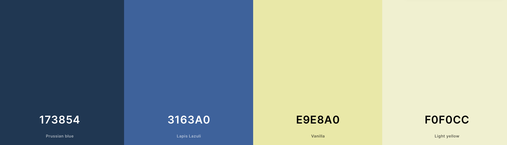

# The Swede Restaurant

## Table of Contents
- [The Swede Restaurant](#the-swede-restaurant)
  - [Table of Contents](#table-of-contents)
  - [Introduction](#introduction)
  - [User Experience](#user-experience)
    - [Epics and User Stories](#epics-and-user-stories)
    - [_Strategy:_](#strategy)
      - [Project goals](#project-goals)
      - [Probable user expectations](#probable-user-expectations)
    - [_Scope_:](#scope)
      - [Content requirements and functional specification](#content-requirements-and-functional-specification)
    - [_Structure:_](#structure)
      - [Pages](#pages)
        - [Visible for unregistered users](#visible-for-unregistered-users)
        - [Visible for registered users](#visible-for-registered-users)
        - [Additional pages](#additional-pages)
      - [Elements of navigation](#elements-of-navigation)
    - [_Skeleton:_](#skeleton)
      - [Wireframes](#wireframes)
      - [Some final words on wireframes](#some-final-words-on-wireframes)
    - [_Surface:_](#surface)
      - [Color Scheme](#color-scheme)
      - [Fonts](#fonts)
  - [Data Model](#data-model)
  - [The Use of Agile Methodology](#the-use-of-agile-methodology)
      - [User Stories](#user-stories)
      - [Epics](#epics)
      - [MoSCoW Labels](#moscow-labels)
      - [Todo Table in Project](#todo-table-in-project)
  - [Features](#features)
    - [For Both Unregistered and Registered Users](#for-both-unregistered-and-registered-users)
      - [Home Page](#home-page)
      - [Menu Page](#menu-page)
      - [Contact Page](#contact-page)
    - [Unregistered User](#unregistered-user)
      - [Navigation Bar Unregistered User](#navigation-bar-unregistered-user)
      - [Make Reservation Page](#make-reservation-page)
      - [Login Page](#login-page)
      - [Register Page](#register-page)
    - [Registered User](#registered-user)
      - [Navigation Bar Registered User](#navigation-bar-registered-user)
      - [Make Reservation Page](#make-reservation-page-1)
      - [My Reservations Page (CRUD)](#my-reservations-page-crud)
      - [Logout Page](#logout-page)
      - [Footer](#footer)
      - [Messages](#messages)
    - [Features Left to Implement](#features-left-to-implement)
  - [Technologies](#technologies)
  - [Testing](#testing)
  - [Deployment](#deployment)
  - [Credits](#credits)

## Introduction

## User Experience

### Epics and User Stories

| EPIC  | ID | USER STORY |
| ------------- | ------------- | ------------  |
| **Navigation**  
|  | #1  | Navigation Bar: As a site user I can easily find the navigation bar so that I can navigate the different pages of the website. |
|  | #2  | Logo Link: As a site user I can click the restaurant logo to get to the home page so that it is easy to navigate back if necessary.   |
|  | #3  | Find Menu: As a site user I can easily find the menu so that I can explore the food options.   |
|  | #4  | Find Reservation Form: As a site user I can easily find where to make a reservation so that I can schedule when to visit the restaurant.   |
|  | #5  | Find Contact Details: As a site user I can find the contact information to the restaurant so that I know how to contact them if needed.   |
| **Content**  
|  | #6  | Home Page: As a site user I can get a clear first impression of what the site is about so that I can decide if I want to explore the website further. |
|  | #7  | View Menu: As a site user I can view a clean and simple menu with relevant information so that I can quickly decide what I want to eat.   |
|  | #8  | View Images of Food: As a site user I can view images of the food so that I know what it looks like.   |
|  | #9  | Social Media Links: As a site user I can easily find the restaurants social media links so that I can learn more about their business.   |
|  | #10 | Design: As a site user I can enjoy a clean and simple design so that it is not a distraction when looking for information.   |
|  | #11 | Leave Review: As a site user I can find where to leave a review so that I can share my experience with others.  |
|  | #12 | Download Menu: As a site user I can download the menu so that I can access it whenever.   |
|  | #13 | Opening Hours: As a site user I can easily find the opening hours of the restaurant so that I know when it is possible to visit.   |
|  | #14 | View Map: As a Site User I can view the location of the restaurant on Google Maps so that I know where it is located.   |
| **Registration and Account Management**  
|  | #15 | Create Account: As a site user I can create an account so that I can make, save, and manage my reservations.   |
|  | #16 | Login: As a registered user I can log in to my account so that I can access my information and reservations.   |
|  | #17 | Logout: As a registered user I can log out from my account so that I can protect my personal information.   |
|  | #18 | Forgot Password: As a registered user I can reset my password so that I can keep my account save and access my information even if I forget my login information.   |
|  | #19 | Delete Account: As a registered user I can delete my account so that I have the choice to remove my information from the site.   |
|  | #20 | Admin Panel: As a restaurant owner/site manager I can view reservations from an admin panel so that I can plan my business.   |
| **Reservations**  
|  | #21 | Make Reservation: As a registered user I can make a reservation at the restaurant through a form so that I can schedule a date and time to visit  |
|  | #22 | View Reservations: As a registered user I can view my reservation(s) so that I can check the details.   |
|  | #23 | Manage Reservation: As a registered user I can manage my reservation after its been saved in my account so that I can keep the restaurant updated if something changes.   |
|  | #24 | Cancel Reservation: As a registered user I can cancel my reservation so that the date and time get available for other customers  |

To ensure that the planning process of this project would be structured and lead to a well functioning application with relevant features, I based the planning on the five planes of UX: Strategy, Scope, Structure, Skeleton, and Surface. More information on each plane in relation to this project below.

### _Strategy:_

#### Project goals

* The goal is to build a website for a restaruant called "The Swede Restaurant" that serves traditional Swedish food. The site needs to include information necessary for a user to decide if they are interesed in visiting, and if they are, how and when to get there.

* The most important feature of the website is the booking system and its functionality. Users should be able to easily make a reservation online and then view, edit, or/and cancel it if necessary.

* The target audience is people who enjoy experiences revolving food and culture.

#### Probable user expectations

* Accessibility for all users.
* Easy navigation throughout the site.
* Relevant information - not too much and not too little.
* A booking system that is similar to other online booking systems. Making a reservation should be easy.
* A visually pleasing design without distractions.

### _Scope_:

#### Content requirements and functional specification

* The most important features to include:
  * A menu
  * **A booking system** that meets the requirements for full CRUD funtionality. The booking system should include a calendar for date, a selection of availabe time slots, a section for number of guests, and the possibility to add a message for special requests.
  * A page with the restaurants contact information. Would preferably contain a map of the restaurant's location.
  
* The user should have to register to make a reservation and for this to be possible, sections for authentication and registration have to be included.

* The design should be responsive so that users can access and use the site on different devices/screen sizes. 

### _Structure:_

#### Pages

The site consists of a total of 10 different pages (Pages marked with ** are displayed and look the same for both unregistered and registered users).

##### Visible for unregistered users

* Home Page**: Contains a hero image with text, in addition to buttons linking to different sections of the site.
  
* Menu Page**: Contains the menu and its items.
  
* Make Reservation Page: Displays a message saying that users have to be registered and logged in to make a reservation. Contains links to both sign in and sign up pages.
  
* Login Page: Contains a form prompting for the user's login information. Also contains a link for registration in case the user is not already a customer.
  
* Register Page: Contains a form where the user can choose a username and password to sign up, in addition to an optional email field. Also contains link to the login page in case the user is already a customer.
  
* Contact Page**: Contains contact information and opening hours. Same page for unregistered and registered users.

##### Visible for registered users

* Home Page**: Contains a hero image with text, in addition to buttons linking to different sections of the site. Same page for unregistered and registered users.
  
* Menu Page**: Contains the menu and its items. Same page for unregistered and registered users.
  
* Make Reservaton Page: Contains the form to make a reservation, prompting user input.
  
* My Reservations Page: Displays a table of data (reservations made) specific to the logged in user. Offers buttons with the options to edit or cancel the reservation, and an additional button linking to  the bookings form to make a new reservation. A message is displayed if there are no reservations to show.
  
* Contact Page**: Contains contact information and opening hours. Same page for unregistered and registered users.
  
* Logout Page: Contains a message asking if the user is sure they want to sign out and a button for signing out.

##### Additional pages

* 404 Page - Contains "page not found" message and link back to home page.

#### Elements of navigation

* A navigation bar with clearly displayed links to relevant content is visible at all times while exploring the site.
  
* The restaurant logo in the navigation bar is linked to the home page.
  
* A "make reservation" button is visible on different sections of the site, so that the way from deciding to visit the restaurant to actually making a reservation is as short as possible.

* A map of the restaurants location should be available where it would be expected to be: the contact page. (Not implemented in this release due to time contraint.)

### _Skeleton:_

#### Wireframes
These wireframes were created using [Balsamiq](https://balsamiq.com/) in the early planning stages.

<strong>Home Page</strong>

Desktop: 

Tablet:

Mobile:

<strong>Menu Page</strong>

All devices (with the exception of the responsive navbar):

<strong>Reservation Page</strong>

Items were planned to stack on top of each other on smaller screens in addition to the responsive navbar.

<strong>Contact Page</strong>

Sections were planned to stack on top of each other on smaller screens in addition to the responsive navbar.

#### Some final words on wireframes

* The screenshots presented above were the inital wireframes created. The end result of the site looks similar to these wireframes, yet there are some differences.

* Wireframes for authentication and registration were left out to save time, as the integrated Django-Allauth would be used to create the base for these templates and I was not sure how easy they would be to customize to fit the design of the rest of the site. However, the Allauth templates have now been customized and fit the overall design. In addition, Django-crispy forms was used for the reservation form, which was not an aspect I considered when creating the wireframes.

* With time I will update the wireframes according to the changes made.

### _Surface:_

#### Color Scheme

* To create the color scheme for this project I used **[Coolors](https://coolors.co/)**.
  
* The goal was to connect Sweden and the Swedish flag to the site by the blue and yellow color scheme. The actual colors of the flag would have been too bright and sharp to include in the overall design, and I therefore customized the shades for improved User Experience.
  
#### Fonts 

* I used **[this article](https://www.pagecloud.com/blog/best-google-fonts-pairings)** to decide what Google Fonts to pair.

## Data Model

## The Use of Agile Methodology

An agile approach was used for the development process of this project. By the use of a GitHub project including issues (user stories), milestones and MoSCoW labels I kept track of the progress. For future projects, I will also plan and document the development process in sprints, to get a better overview of the timeframe.

The GitHub project can be viewed  **[here](https://github.com/users/gustafsson96/projects/6)**.

#### User Stories 

The user stories were created as GitHub issues. Each user story (with the exepction of a few labeled "won't have") contains related acceptance criterias and tasks that were checked off continuously as the requirements were met.

#### Epics

Epics were created as milestones. The user stories for each epic were then linked to the relevant milestone.

An additional milestone to keep track of the project setup was also included.

#### MoSCoW Labels

MoSCoW labels were created to prioritize the GitHub issues with user stories. An additional setup label for the intial setup steps was also included. I also kept the default documentations label, but ended up not using it.

#### Todo Table in Project

Items were moved between Todo, In Progress, and Done as the work progressed.

This was the final view of the todo table. The items left in Todo are all labeled "won't have" for this release.

## Features

### For Both Unregistered and Registered Users

#### Home Page

The landing page consists of a hero image and a textbox. The textbox contains the name of the restaurant, a short paragraph, 
and a clickable button. The button links either to a page inviting the user to sign in/sign up if they are logged out/not already a customer, or to the "make a reservation form" if they are logged in. The button disappears on screens smaller than 620px to make the design cleaner, as the section below the hero image is more visible on smaller screens and therefore displays a button with the same links without the user having to scroll.

Below the hero image is a section with three clickable buttons linking to different content of the site that 
the user is likely to look for. These containers are stacked on top of each other on smaller screens. Below the buttons
 is an inviting "Welcome to Us" text.

#### Menu Page

The menu page contains a table with all menu items available at the restaurant, in addition to short descriptions and price.

#### Contact Page

The contact page contains contact information and the opening hours of the restaurant. As there is not much 
text on the screen, I decided to add a pattern in the relevant color scheme to make the page more interesting and 
on the theme of the restaurant.

### Unregistered User

#### Navigation Bar Unregistered User

For an unregistered user, the navbar contains six items to the right (home, menu, make reservation, login, register, contact), in addition to the restaurant logo to the left. The items are accompanied by a relevant font awesome icon and they link to their associated page. The logo is linked to the home page. The navigation bar is fixed to the top at all times.

#### Make Reservation Page

The make reservation page for an unregistered user contains a message inviting the user to log in or sign up if they want to make a reservation. There are also two buttons linking to the login and the signup page.

#### Login Page

The login page contains a form where user input is required in the form of username and password in order to log in. There is also a link to the sign up page in case the user is not registered yet. 

#### Register Page

The register page (the sign up page) is where the user can create an account. It contains a 
form where user input is required in the form of username and password in order to sign up. Email is optional.
There is also a link to the sign in page in case the user is already registered.

### Registered User

#### Navigation Bar Registered User

For a registered user, the navbar contains six items to the right (home, menu, make reservation, my reservations, contact, logout), in addition to the restaurant logo to the left. The items are accompanied by a relevant font awesome icon and they link to their associated page. The logo is linked to the home page. The navigation bar is fixed to the top at all times.

#### Make Reservation Page

The make reservation page for a registered user is where a reservation can actually be made. It contains a form 
where name, date, time, and number of guests is required. A message to the restaurant is optional.

#### My Reservations Page (CRUD)

* The my reservations page is where the user can view, edit, and cancel their reservations.
This page is therefore responsible for most of the CRUD functionality of this application.
* Name, date, and time are the booking details displayed.
* If there are no reservations to view, a message is displayed.
* If the user decides to add a message to their reservation, it will not show here to make this table less crowded and easier to read, but they still have the option to change or add a message if they click "edit".
* There is also a button for making a new reservation.

The form to edit the reservation.

Message displayed if user cancels a reservation.

#### Logout Page

If the user clicks "logout" in the navigation bar, they will relocate to the logout page where they are 
asked if they are sure they want to log out. If the answer is yes, they can click the button to log out.

#### Footer

The footer contains two social media links to Facebook and Instagram. It stays at the bottom of the screen for all pages.

#### Messages

For user feedback, messages are displayed when actions are performed by the user. The messages disappear by themselves but can also be clicked by the user if they want them to disappear quicker.
The messages below are only a few examples, there are more available.

### Features Left to Implement

* Home Page: Add more content and images to give the user a clearer first impression of the restaurant.

* Contact page: a Google Map with the restaurants location pinned.
  
* Menu page: images of the food next to the menu items.
  
* Menu page: Make it possible to download the menu as a pdf.
  
* New Page: Make it possible for the user to leave a review.

## Technologies

Languages, Packages, Frameworks, Libraries, Programs etc.

## Testing

Link to separate TESTING.md file. Brief information about what is in testing.md file.

## Deployment

Create the repository.
Create the Django.
Create Heroku app.
(Environment Variables, settings.py?)
Deployment Heroku.
Final deployment after project is done.
(Remember to set debug to FALSE and deploy manually).

Section for forking?

## Credits

References to reused and customized code.

Important links and sources that have contributed to my understanding of the concepts required to create this project.

Content and media (pictures etc).

